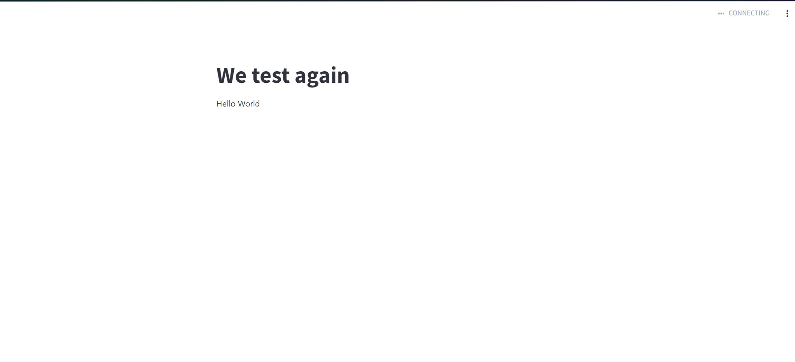

# TP Data Collection

Ce repos contient l'application du tp data collection avec comme back [Streamlit](https://streamlit.io) et comme front [React]('https://fr.react.dev/').

Pour plus d'info clique [ici](https://docs.streamlit.io/en/latest/streamlit_components.html)!

## Les prerequis

Avant d'installer le repos vous devez avoir les prerequis suivants:

- [Le langage "Python3"](https://www.python.org/downloads/)
- [Le serveur JavaScript "node js"](https://nodejs.org/en)
- [Le gestion de package python "Poetry"](https://www.python.org/downloads/)

## Installation du repos et des packages

- Tapez les commandes une a une dans votre terminal.

- Pour la partie back "Streamlit":

```
$ git clone https://github.com/Dar-rius/dc.git  # clone repos
$ cd dc # move to folder dc
$ poetry install  # install all packages with poetry
$ poetry shell   # activate env
$ cd template   # move to template folder
$ pip install -e . # install template as editable package
$ streamlit run app.py # run server streamlit
```

- Pour la partie frontend "node js":

Ouvrez un nouveau terminal et deplacez vous vers le repos dc et tapez les commandes suivantes:

```
$ cd template/myApp/frontend #Move to frontend folder
$ npm install    # Install npm dependencies
$ npm start  # Start the Webpack dev server
```

- Ensuite taper dans le navigateur [localhost:8501](http://localhost:8501/):
- Vous arriverez sur cette page comme dans la capture ci-dessous:
  

## Plus d'informations

- [Streamlit Components documentation](https://docs.streamlit.io/library/components)
- [Streamlit Forums](https://discuss.streamlit.io/tag/custom-components)
- [Streamlit Components gallery](https://www.streamlit.io/components)
